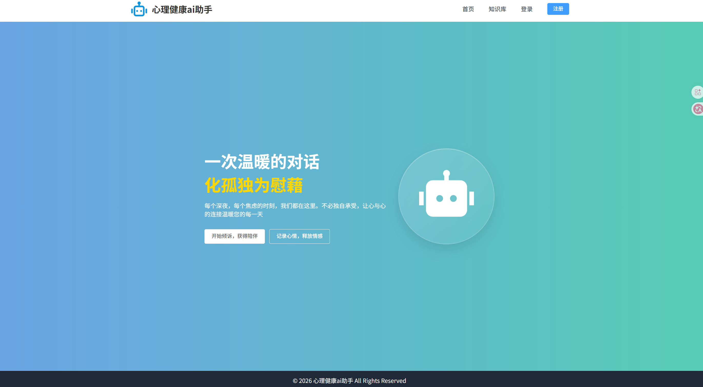
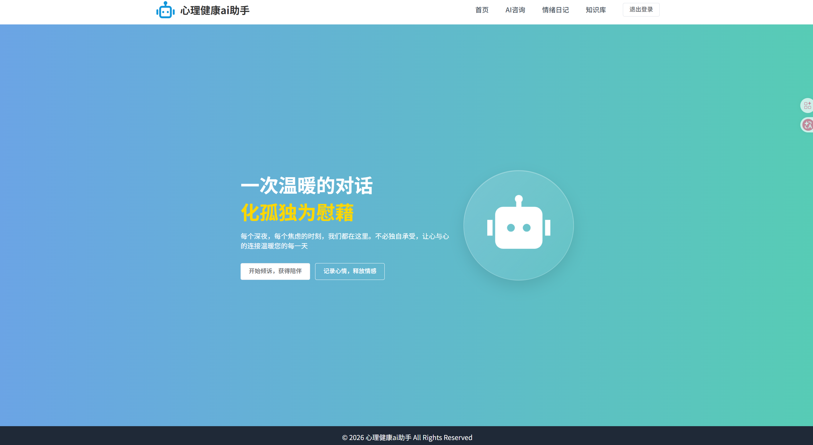
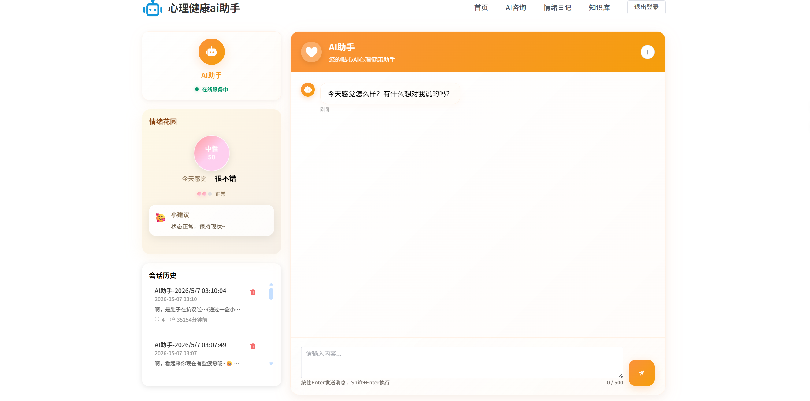
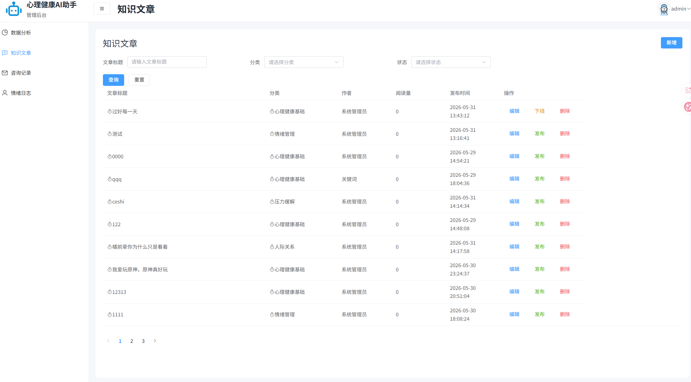
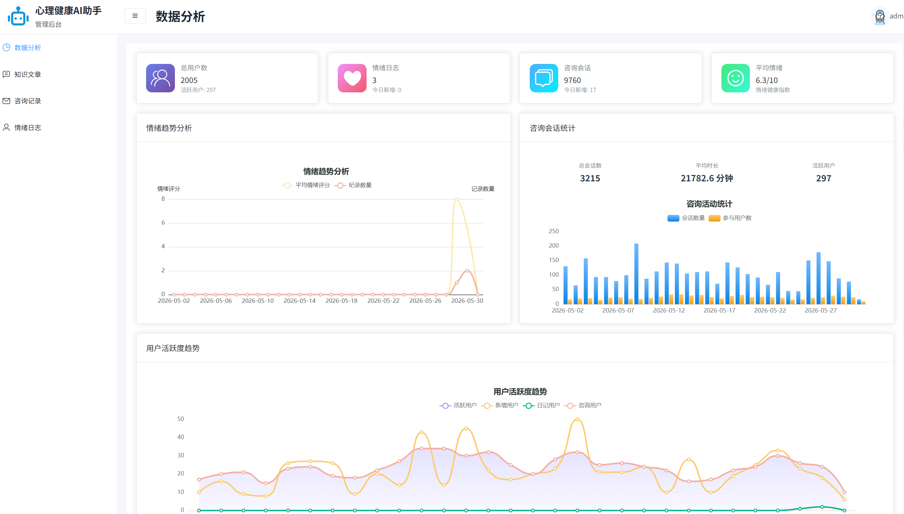
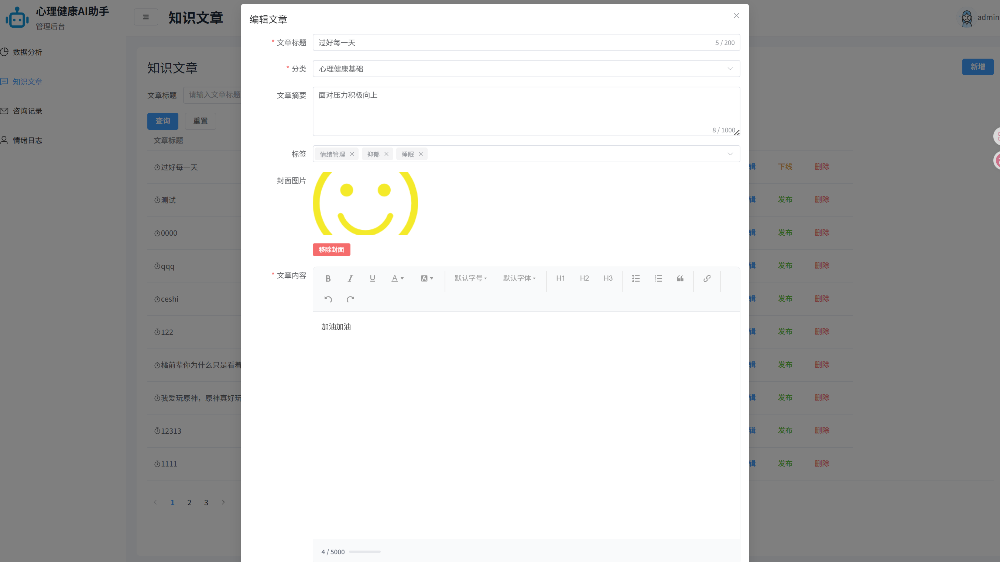

# 心理健康 AI 助手前端项目

一个基于 `Vue 3 + Vite + Element Plus` 开发的心理健康 AI 平台前端项目，包含前台用户端、后台管理端和登录注册模块。

## 项目简介

本项目围绕“心理健康服务”场景设计，主要提供以下能力：

- 前台用户端：首页展示、AI 咨询、情绪日记、知识文章浏览
- 后台管理端：数据分析、知识文章管理、咨询记录管理、情绪日志管理
- 认证模块：用户登录、注册、登出
- AI 咨询：支持会话历史、流式回复、情绪分析结果展示

## 技术栈

| 分类 | 技术 |
|------|------|
| 框架 | Vue 3 |
| 构建工具 | Vite |
| 路由 | Vue Router 4 |
| 状态管理 | Pinia |
| UI 组件库 | Element Plus |
| HTTP 请求 | Axios |
| 流式通信 | `@microsoft/fetch-event-source` |
| 富文本编辑 | WangEditor |
| 图表可视化 | ECharts |
| 样式 | Sass |

## 功能模块

### 前台用户端

- 首页展示
- AI 心理咨询
- 情绪日记
- 知识文章列表
- 文章详情页

### 后台管理端

- 数据分析看板
- 知识文章管理
- 咨询记录管理
- 情绪日志管理

### 认证模块

- 登录
- 注册
- 登出

## 项目结构

```text
src/
├─ api/                # 接口层，按后台/前台拆分
├─ assets/             # 静态资源
├─ components/         # 公共组件
├─ config/             # 基础配置
├─ router/             # 路由配置与前置守卫
├─ stores/             # Pinia 状态管理
├─ utils/              # 工具函数与请求封装
├─ views/              # 页面级组件
├─ App.vue
└─ main.js
```

## 核心设计说明

### 1. 多端路由拆分

项目将路由分为三部分：

- `/`：前台用户端
- `/back`：后台管理端
- `/auth`：登录注册模块

同时使用路由前置守卫，根据 `token` 和 `userInfo.userType` 控制访问权限。

### 2. 统一请求封装

项目在 `src/utils/request.js` 中对 Axios 进行了统一封装：

- 统一添加 token
- 统一处理业务状态码
- 统一处理登录过期与错误提示

### 3. AI 咨询流式回复

项目在 `src/views/consultation.vue` 中使用 `fetch-event-source` 对接流式聊天接口，实现：

- 新建会话
- 历史会话切换
- AI 实时输出
- “正在输入中”状态展示
- 情绪分析联动展示

### 4. 后台文章管理

后台文章管理模块支持：

- 动态搜索表单
- 文章新增/编辑
- 封面上传
- 富文本编辑
- 发布、下线、删除

## 安装与启动

### 1. 安装依赖

```bash
npm install
```

### 2. 启动开发环境

```bash
npm run dev
```

项目默认启动在：

```text
http://localhost:5173
```

### 3. 打包构建

```bash
npm run build
```

### 4. 本地预览

```bash
npm run preview
```

## 接口代理说明

开发环境下，Vite 已配置 `/api` 代理：

```js
target: 'http://159.75.169.224:1235'
```

如果后端地址变化，请修改：

- `vite.config.js`
- `src/config/index.js`

## 主要页面说明

| 页面 | 路径 |
|------|------|
| 首页 | `/` |
| AI 咨询 | `/consultation` |
| 情绪日记 | `/emotion-diary` |
| 知识库 | `/knowledge` |
| 登录 | `/auth/login` |
| 注册 | `/auth/register` |
| 后台首页 | `/back/dashboard` |
| 文章管理 | `/back/knowledge` |
| 咨询记录 | `/back/consultations` |
| 情绪日志 | `/back/emotional` |

## 项目截图
### 未登录首页


### 用户端首页



### AI 流式对话



### 管理端文章管理



### 数据看板



### 富文本编辑



## 当前项目特点

- 前后台一体化路由架构
- 用户端与管理端布局分离
- 统一接口层与鉴权逻辑
- AI 咨询支持流式交互
- 后台支持富文本文章管理
- 数据分析页面支持图表可视化

## 已知说明

- 当前项目已具备基本业务流程，但部分接口行为依赖后端返回格式
- 项目中暂未配置 ESLint、Prettier 和自动化测试
- 如果出现 AI 回复异常，需同时检查前端流式接口参数和后端会话服务状态

## 后续可优化方向

- 增加权限粒度控制
- 增加请求重试与错误监控
- 增加组件单元测试和路由守卫测试
- 优化大体积打包产物，做按需拆包
- 完善 README 中的部署说明与接口文档

